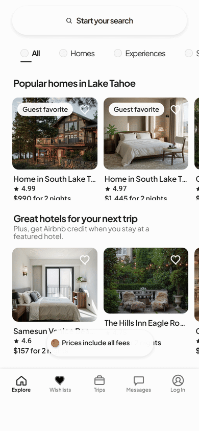
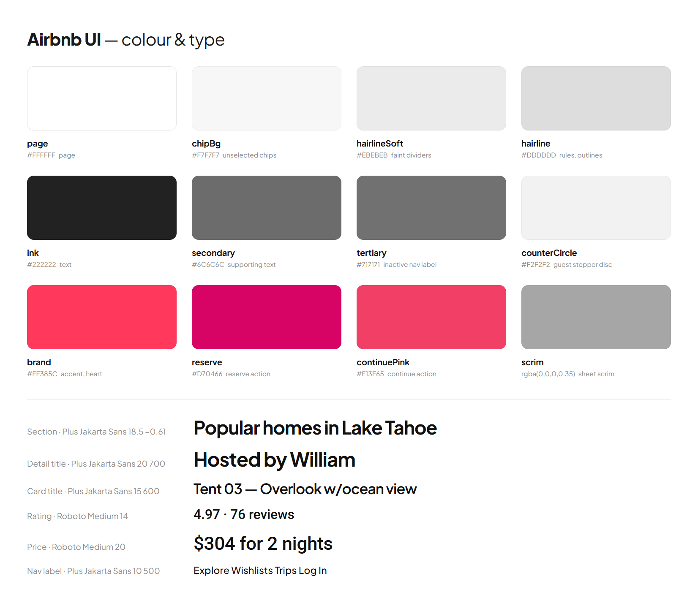

<p align="center">
  <a href="https://airbnb-ui.edgeone.cool"></a>
</p>

<h1 align="center">Airbnb UI</h1>

<p align="center">
  <a href="https://airbnb-ui.edgeone.cool"></a>
</p>

<p align="center">
  A high-fidelity, interactive recreation of Airbnb's mobile interface — real components, real state, running in your browser.<br>
  <a href="DESIGN.md">DESIGN.md</a> · <a href="#design-notes">Design notes</a> · <a href="#explore-the-prototype">Explore</a> · <a href="#run-locally">Run locally</a> · <a href="#scope-and-limitations">Scope</a> · <a href="https://github.com/migrant620/awesome-app-design-md">More apps →</a>
</p>

---

Created to help people get to know Airbnb's booking flow through a hands-on exploration of its interface, and to appreciate the details that make browsing places to stay feel effortless. For the full experience of searching and booking, explore [Airbnb](https://www.airbnb.com).

Everything runs locally in your browser with sample data; it does not connect to an Airbnb account and cannot place a booking.

## Design notes

What makes Airbnb's interface work, and what this recreation had to get right.

**The photograph is the only loud element.** Everything around a listing is white: the page, the cards, the sheets. Airfare-scale photography carries the colour, and the interface steps back so it can. Text is a near-black `#222222` with a quieter `#6C6C6C` for the supporting line — price and rating are the two things set in a different voice, both in Roboto for their digits.

**Search is a sentence you fill in, one clause at a time.** Where, When, Who are three stacked lines rather than three separate screens, so you can see the whole query while you edit one part of it. Each line states its current answer in bold and its question in grey, which keeps a half-finished query readable.

**The fifth tab is a person, not a bookmark.** Log In is a stroked ring with a stroked figure inside it — a head left open at the bottom and two shoulder strokes running down to the ring, all in one weight. Nothing is filled. It reads as a quiet counterpart to the four glyph tabs beside it, and it is drawn to the same measurements as the reference rather than approximated.

**One accent, spent on the decision.** `#FF385C` is structural — the selected tab, the guest-favourite badge, the heart. The Reserve button steps one shade deeper to `#D70466` so the single action that costs money is the single darkest thing on the page.

**Details that carry the polish.** Card price and rating sit on the same baseline so a grid of cards reads as columns rather than blocks; the "Prices include all fees" pill floats above the nav instead of sitting in a bar; and the photo viewer keeps a counter in the corner so you always know how deep you are.

## Design system at a glance

<p align="center"></p>

The full token set — colours, type scale, spacing, radii, elevation and component notes — is in [DESIGN.md](DESIGN.md); the values live in [`src/tokens.ts`](src/tokens.ts).

## Explore the prototype

| Area | Things to try |
|---|---|
| Explore | Switch between All, Homes, Experiences and Services, and scroll both rows of listing cards. |
| Search · Where | Open the search sheet and pick a destination from the recommended list. |
| Search · When | Choose a range in the calendar and watch the start, end and in-between days highlight. |
| Search · Who | Add and remove adults, children, infants and pets; the steppers disable at their limits. |
| Results | Read the summary of your query, scroll the result cards and tap through to a listing. |
| Listing detail | Scroll the photo, title, rating, host and highlights; watch the price bar at the bottom. |
| Photo viewer | Open the gallery, swipe between photos and follow the counter. |
| Log in sheet | Tap the heart to open the sign-in sheet, then close it. Sign-in is not functional. |

### A first walkthrough

1. On **Explore**, tap the search pill to open the search sheet.
2. Under **Where**, pick a destination from the list.
3. Under **When**, tap two dates to set a range.
4. Under **Who**, set 2 adults, then press **Search**.
5. Scroll the results, open a listing, and swipe through its photos.
6. Go back to **Explore** and tap a heart to see the sign-in sheet.

Sample content lives only in the page; reloading starts a fresh session.

## Run locally

Use Node.js 22.13 or newer in the Node.js 22 release line, with npm.

```bash
npm ci --ignore-scripts
npm run web
```

Open the local URL printed by Expo. Dependency installation requires an internet connection. No Airbnb account or API key is required.

### Build for the web

```bash
npm run typecheck
npm run build:web
```

The static output is written to `dist/`. Serve that directory over HTTP or HTTPS; opening `index.html` directly as a local file is not supported.

## Scope and limitations

- **First batch of screens, still being finished.** The Explore screens and the search sheet (Where, When, Who) are the most complete. The search-results list, the listing detail page, the photo viewer and the sign-in sheet are built and reachable but have not yet been brought to the same standard.
- **Sample content.** Every listing, host and review is fictional and every photograph is an original work produced for this prototype. No Airbnb photography, host imagery, illustration or brand graphic is used.
- **Typeface.** Airbnb uses Cereal, a proprietary typeface. This prototype uses the open Plus Jakarta Sans, matched per-character and tracked in so the key strings occupy the same width. Stroke weight differs slightly. Numerals use Roboto.
- **Icons.** The navigation and interface glyphs are original vector drawings traced to the reference geometry; they are close approximations, not the original artwork.
- **Sign-in is appearance only.** The sheet reproduces what a signed-out visitor sees and can be closed; there is no account, no booking and no payment anywhere in the prototype.
- **Not yet built.** Filtering, interactive map panning and zooming (the results map is a stylised original illustration with fixed pins), wishlists, Trips, Messages and the full facilities and review lists are out of scope for this batch.
- **Mobile layout on the web.** The interface is designed for a phone-width column; on wider screens it stays a centred column.
- **Validation scope.** The geometry and colour of each state are checked against the reference at phone width and at three smaller viewports in Chromium. This does not establish feature completeness, full visual equivalence, or Safari, Firefox, native Android or native iOS acceptance.

## Commission a prototype

Have an app whose screens you want to put in front of your team, a client or investors? I recreate chosen app interfaces and flows as high-fidelity, interactive prototypes and hand over the source code. [Open an issue](https://github.com/migrant620/airbnb-ui/issues/new?title=Prototype%20enquiry) with the app, the flow you need and your timeline.

## License

The prototype's original code and materials are **source-available for noncommercial self-directed study and research only**, under the [M620 Study and Research License](LICENSE). Commercial products, business use, client deliverables, and hosted services are not permitted without a separate written license. Free access does not itself permit commercial use.

This is not an open-source license. Third-party components retain their own licenses.

## Attribution

This is an independent prototype by M620, not an official Airbnb product and not affiliated with or endorsed by Airbnb. Third-party names identify the interface being demonstrated.

Bundled fonts retain their own licenses: Roboto under the Apache License 2.0 and Plus Jakarta Sans under the SIL Open Font License 1.1, with the full texts in `assets/fonts/`. See the [third-party notices](public/third-party-notices.txt); the web build also serves this file at `/third-party-notices.txt`.
